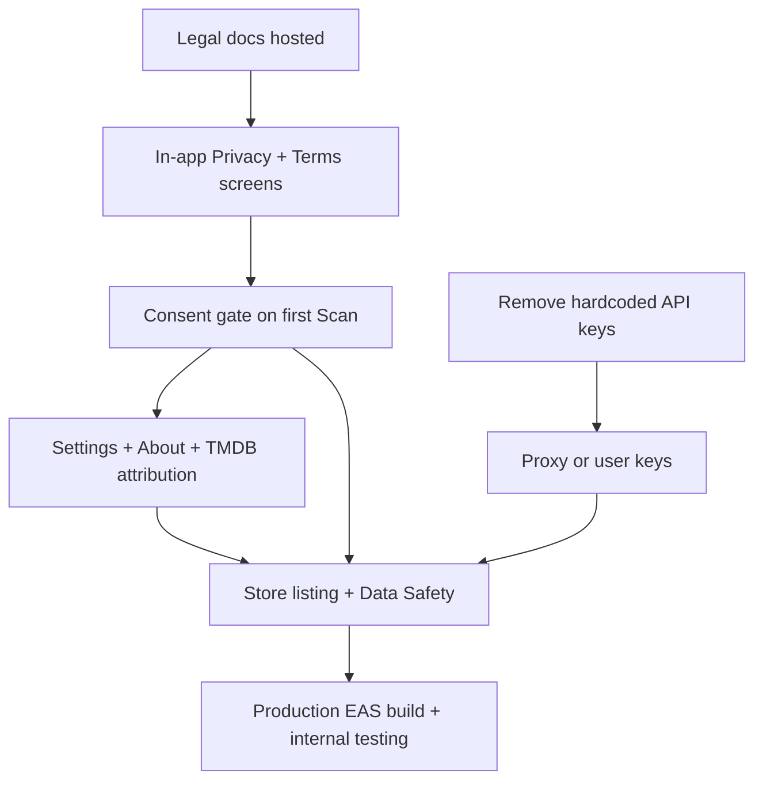

# Production readiness plan — CineScan / MyCinema

**Canonical file location (repo root):** [`/root/filmsort/PRODUCTION_READINESS_PLAN.md`](file:///root/filmsort/PRODUCTION_READINESS_PLAN.md)  
*(On plan approval, this document is written to the filmsort project root as `PRODUCTION_READINESS_PLAN.md`.)*

Based on [play_store_and_market_research.md](file:///root/filmsort/play_store_and_market_research.md) and an audit of the current codebase. The app has a working library, scanner, player, and metadata flow, but several **Play Store blockers** and **legal/UX gaps** must be closed before a public release.

---

## Already in good shape (from research + code)

| Area | Status |
|------|--------|
| Storage permissions | **PASS** — uses `expo-media-library` / SAF-style access, not `MANAGE_EXTERNAL_STORAGE` |
| Core product loop | Scan → match → library → details → local playback |
| Offline library | Local files + AsyncStorage library / progress |
| Media permissions copy | `app.json` has user-facing permission strings for video |

---

## Critical: Play Store & legal (from research doc)

These are called out as **Action Required** in the research report and are still missing or incomplete.

### 1. Privacy Policy (hosted URL + in-app)

**Why:** Play requires a public Privacy Policy URL and a Data Safety form. The app sends **video filenames** (not file bytes) to TMDB / Gemini (and uses Sarvam) for matching.

**Must state clearly (research wording):**

> The app collects and transmits media filenames and metadata via HTTPS to TMDB and Gemini API for matching. No video file content is uploaded, shared, or stored on remote servers.

**Deliverables:**

- Hosted Privacy Policy page (GitHub Pages, Notion public page, or simple static site)
- Same content viewable **in-app** (WebView or dedicated screen)
- Play Console Data Safety form filled to match reality (filenames, network, no video upload)

### 2. Terms of Use (hosted URL + in-app)

**Why:** Complements privacy; covers acceptable use, local-file responsibility, no affiliation with Netflix/TMDB, AI matching limitations, liability.

**Deliverables:**

- Hosted Terms of Use page
- In-app screen / WebView
- Version or “last updated” date for consent logging

### 3. First-time Scan consent gate (your idea)

**Product rule:** When a **new user** (or any user who has not accepted) taps the **Scan** bottom tab, the app **must not** run the scanner until they have read and accepted legal docs.

**Proposed UX:**

1. User taps **Scan** tab  
2. If `@cinescan:legal_consent` is missing / outdated version → show **LegalConsent** modal or full screen  
3. Content: short summary + links to **Privacy Policy** and **Terms of Use** (open in-app)  
4. Checkboxes or single clear CTA:  
   - “I have read and agree to the Terms of Use and Privacy Policy”  
   - Optional secondary: “I understand that media **filenames** (not video files) may be sent to third-party APIs for matching”  
5. **Accept** → persist `{ acceptedAt, termsVersion, privacyVersion }` → allow Scan  
6. **Decline** → stay on Scan tab with blocked scanner + message; or bounce to Library  

**Implementation sketch:**

| Piece | Approach |
|-------|----------|
| Persistence | `AsyncStorage` key e.g. `@cinescan:legal_consent` |
| Gate | `ScannerScreen` or `TabNavigator` listener on Scan focus |
| UI | New `LegalConsentScreen` or modal component |
| Re-prompt | Bump `LEGAL_DOC_VERSION` when policy text changes |

**Do not** request media permissions until after consent (best practice: consent → then system permission dialog on first actual scan).

### 4. API key security (research §2)

**Current state (blocking for production):**

- Hardcoded fallbacks / secrets in client:  
  - `tmdbService.ts` — TMDB key fallback  
  - `geminiAIService.ts` — Gemini key  
  - `sarvamAIService.ts` — Sarvam key  

**Required action (pick one):**

| Option | Description |
|--------|-------------|
| **A (recommended)** | Proxy backend (Cloud Function / Edge Function) so keys never ship in the APK |
| **B** | Settings: user pastes own TMDB/Gemini keys → local storage only |

Until this is fixed, keys can be extracted from the APK and abuse will hit your quotas / billing.

### 5. TMDB attribution & About screen (research §4)

**Missing today:** no Settings / About / Attributions UI.

**Required:**

- **About / Attributions** screen with mandatory TMDB line:  
  *“This product uses the TMDB API but is not endorsed or certified by TMDB.”*  
- TMDB logo where appropriate (per TMDB terms)  
- Credit Jikan/MAL for anime paths if used  
- App name consistency: store listing vs `app.json` (`MyCinema` vs CineScan)  

---

## High priority product gaps (not only legal)

### 6. Settings hub

Central place for:

- Privacy Policy / Terms (always accessible after consent)
- About & attributions  
- Optional API keys (if Option B)  
- Clear library / clear caches  
- App version (`expo-constants` or `Application.nativeApplicationVersion`)  
- Notification preferences  

**Entry points:** FloatingHeader overflow, or a gear on Library / Scan header.

### 7. App identity & store listing assets

| Item | Notes |
|------|--------|
| Display name | Align `app.json` `name`, package, and marketing (CineScan vs MyCinema) |
| Feature graphic, screenshots (phone + tablet) | Required for Play |
| Short & full description | Local video organizer; not a pirate streaming app |
| Content rating questionnaire | Complete in Play Console |
| Privacy Policy URL field | Must match hosted page |

### 8. Permissions & Android policy hygiene

- Confirm `WRITE_EXTERNAL_STORAGE` is still needed; drop if unused (reduces review friction)  
- Ensure media permission rationale strings match real behavior  
- Target recent SDK via EAS production profile  

### 9. Reliability & supportability

| Gap | Why |
|-----|-----|
| No error boundary / crash reporting | Hard to fix production issues (Sentry / Crashlytics optional but recommended) |
| No offline / rate-limit UX | TMDB/Gemini failures should show user-friendly messages |
| No “delete all my data” | Aligns with privacy policy and user trust |
| Console `console.log` noise | Strip or gate for production builds |

### 10. Monetization (research survey only — optional for v1)

Survey explores ads vs one-time unlock. **Not required for launch**, but decide explicitly:

- Free / ad-free v1, or  
- Optional remove-ads IAP later  

Do not ship ads without a privacy disclosure update.

---

## Suggested implementation order (PR plan)

### PR 1 — Legal content & screens
- Static Privacy Policy + Terms of Use (markdown or hosted HTML)
- In-app screens (scrollable text or WebView + open in browser)
- Constants: `PRIVACY_VERSION`, `TERMS_VERSION`, public URLs

### PR 2 — Scan consent gate
- `legalConsentService` (get/set accepted versions)
- Block scanner until accepted when user opens Scan tab
- Checkbox + Accept CTA; decline path
- Re-prompt when doc version bumps

### PR 3 — Settings / About
- Settings screen from header
- Attributions (TMDB, anime source)
- Links to legal docs; version; clear cache/library

### PR 4 — Secrets & API config
- Remove all hardcoded API keys from repo (rotate exposed keys immediately)
- Implement proxy **or** user-supplied keys in Settings
- Env-only config for any remaining non-secret defaults

### PR 5 — Store readiness polish
- App name / branding consistency  
- Permission audit  
- Empty/error states for network failure during scan  
- Play listing copy, screenshots, Data Safety form checklist  

---

## Consent gate — detailed acceptance criteria

- [ ] Fresh install → open Scan → **cannot** start scan until Accept  
- [ ] After Accept → Scan works; media permission can then be requested  
- [ ] Privacy + Terms open fully readable in-app before Accept  
- [ ] Accept stored across restarts  
- [ ] Bumping legal version forces re-accept  
- [ ] Settings always shows links to Privacy / Terms after first open  

---

## Out of scope for “minimum production”

- Full backend accounts / cloud library sync  
- Ads / IAP (unless you choose them for v1)  
- Market survey execution (research Part 2 is validation, not app code)  
- iOS App Store listing (same legal screens apply later)  

---

## Summary

**Must ship for Play-ready:**

1. Hosted + in-app **Privacy Policy** and **Terms of Use**  
2. **Consent gate** when a new (or non-consented) user taps **Scan**  
3. **Remove/rotate hardcoded API keys**; proxy or user keys  
4. **About / TMDB attribution**  
5. Play **Data Safety** form + listing assets aligned with real behavior  

**Should ship soon after:** Settings hub, clearer network/permission errors, optional crash reporting, branding cleanup.

No code has been changed in this plan-only pass; implementation can start with PR 1–2 (legal docs + Scan consent) as you described.
