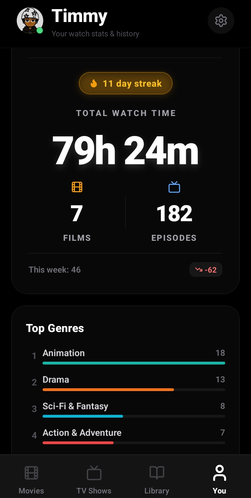
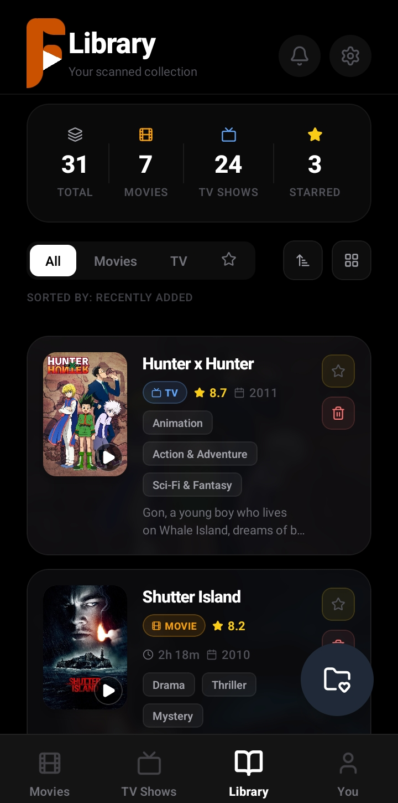
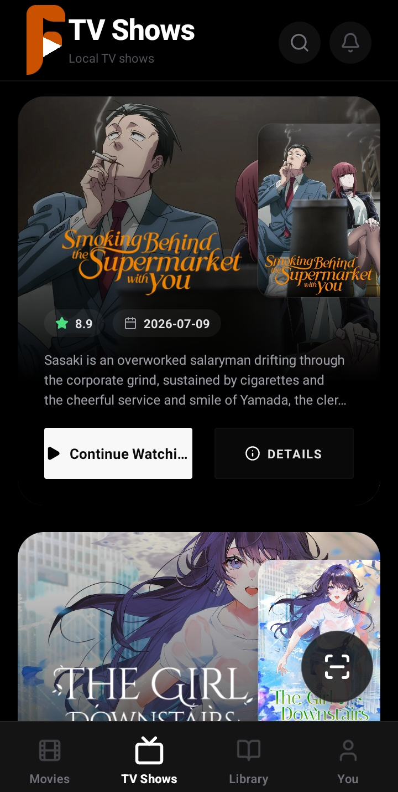
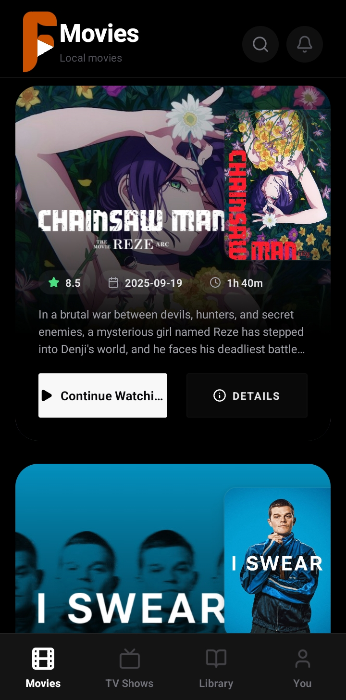

<div align="center">


# FilmSort

**Your local media library — organized, enriched, and alive.**

[](https://expo.dev)
[](https://expo.dev)
[](https://reactnative.dev)
[](https://firebase.google.com)
[](https://workers.cloudflare.com)
[](https://typescriptlang.org)
[](LICENSE)

</div>

---

## The Problem

You've got hundreds of video files sitting on your phone or hard drive. Cryptic filenames like `AnimePahe_Chainsaw.Man.The.Movie.Reze.Arc.1080p.mkv` or `[SubsPlease] Frieren - 18 (1080p).mkv`. No artwork, no descriptions, no idea what you've already watched or where you left off.

Streaming apps know everything about your viewing habits — but only for *their* content. Your local library gets nothing.

FilmSort fixes that. It scans your files, uses Gemini AI to parse even the most mangled filenames, matches everything against TMDB, and turns a folder of raw video files into a proper, beautiful media library — with watch history, streak tracking, collections, watch parties, and a year-end recap that looks like Spotify Wrapped.

---

## Screenshots

<div align="center">

| Movies | TV Shows | Library | Profile & Stats |
|:---:|:---:|:---:|:---:|
|  |  |  |  |

</div>

---

## Table of Contents

- [Features](#features)
- [Architecture](#architecture)
- [Tech Stack](#tech-stack)
- [Getting Started](#getting-started)
  - [Prerequisites](#prerequisites)
  - [1 — Clone & Install](#1--clone--install)
  - [2 — Deploy the Cloudflare Worker](#2--deploy-the-cloudflare-worker)
  - [3 — Firebase Setup](#3--firebase-setup)
  - [4 — Configure Environment](#4--configure-environment)
  - [5 — Run the App](#5--run-the-app)
- [Project Structure](#project-structure)
- [Roadmap](#roadmap)
- [Contributing](#contributing)
- [License](#license)

---

## Features

### AI-Powered Media Scanner
Drop any video file into your library and FilmSort figures out what it is. Gemini AI parses filenames that no regex could handle — fansub releases, anime naming conventions, scene tags, all of it — then matches them against TMDB for posters, descriptions, ratings, and episode info. A smart local parser handles the easy cases offline so Gemini is only called for what it actually needs.

### Built-In Video Player
Play your local files directly inside the app. Per-title watch progress is tracked automatically, so you always know where you left off — across both movies and individual TV episodes.

### Watch History & Stats
Every play is logged. Your profile screen shows total watch time, films watched, episodes completed, top genres, and a daily watch streak. The stats are real — from your actual viewing history, not from what a streaming service says you watched.

### FilmSort Wrapped
An annual year-in-review recap that surfaces your top titles, most-watched genres, anime hours, binge streaks, and a shareable summary. Library titles (even unwatched ones) are woven into the recap as a nostalgic shelf of what you've collected.

### Collections
Build and curate custom lists — a watchlist, a ranked top-10, a "watch with friends" queue. Collections support a quiz-based verification system that can confirm you've actually watched something before adding it. Pro users get Firestore-backed cloud sync for their collections across devices.

### Watch Parties
Host or join a real-time watch party with friends over Firestore. The host's playback state (position, play/pause) is pushed every 2 seconds; guests auto-sync with latency compensation. Includes a live chat overlay inside the player.

### Memories
Generates a shareable HTML email recap — a poster mosaic grid with watch stats — for every unique title you've ever watched. Looks like a YouTube play button. Opens via the native share sheet.

### Cloud Sync
Sign in with Google once and your watch history, starred items, watchlist, profile, and collections sync across devices via Firestore in real time. Local writes always happen first; Firestore is fire-and-forget. Works fully offline — syncs on the next launch.

### QR Code Join & Party Hub
Share a party via QR code that guests can scan to jump straight into the session. The Party Hub shows all active public rooms.

### Subtitle Search
Search and download subtitles via OpenSubtitles directly inside the app, matched to the current file playing.

### Pro Tier
Unlimited AI file scans (free tier has a monthly cap), priority Gemini key lane (Skip the Line), cloud collection backups, and Advanced Memories / Wrapped features.

### Google Cast
Cast your local files to any Chromecast-compatible device via the built-in Cast button.

---

## Architecture

```
┌─────────────────────────────────────────────┐
│              FilmSort App (Expo)             │
│                                             │
│  ┌─────────┐  ┌──────────┐  ┌───────────┐  │
│  │ Scanner │  │  Player  │  │Collections│  │
│  └────┬────┘  └────┬─────┘  └─────┬─────┘  │
│       │            │              │         │
│  ┌────▼────────────▼──────────────▼──────┐  │
│  │           Context + Storage           │  │
│  │  (AsyncStorage · Firestore real-time) │  │
│  └───────────────────┬───────────────────┘  │
└──────────────────────┼──────────────────────┘
                       │ Firebase ID Token (JWT)
                       ▼
        ┌──────────────────────────────┐
        │   Cloudflare Worker (Proxy)  │
        │                             │
        │  POST /tmdb                 │
        │  POST /gemini               │
        │  POST /subtitles/search     │
        │  POST /subtitles/download   │
        └───┬──────────┬──────────────┘
            │          │
     ┌──────▼──┐  ┌────▼────────────┐
     │  TMDB   │  │  Gemini AI API  │
     │  API    │  │  (key pool ×5)  │
     └─────────┘  └─────────────────┘
```

**Key design decisions:**

- **No secrets in the app bundle.** Every API key (TMDB, Gemini) lives in Cloudflare Worker Secrets. The app only ships the Worker URL and a Firebase project ID.
- **Firebase JWT auth on every request.** The Worker verifies the user's Firebase ID token before proxying any call. No token = 401. This prevents quota abuse without any server-side session management.
- **Gemini key pool rotation.** The Worker cycles through up to 5 free-tier Gemini keys on 429, giving ~5× the effective quota. Pro users get a dedicated VIP key lane.
- **Local-first storage.** All data (watch history, library, watchlist, collections) is written to AsyncStorage first. Firestore is a background sync layer — the app is fully functional offline.
- **Gemini parse pipeline:** cache hit → high-confidence local regex → Gemini AI. Most filenames never reach the network.

---

## Tech Stack

| Layer | Technology |
|---|---|
| Framework | React Native 0.81 + Expo SDK 54 |
| Language | TypeScript 5.9 |
| Navigation | React Navigation 7 (native stack + bottom tabs) |
| Styling | NativeWind 4 (Tailwind CSS) |
| Animations | React Native Reanimated 4 |
| Auth | Firebase Auth + Google Sign-In |
| Database | Firestore (real-time sync) |
| Local storage | AsyncStorage (512 MB SQLite backend) |
| API Proxy | Cloudflare Workers |
| AI | Google Gemini (via Cloudflare proxy) |
| Media metadata | TMDB API |
| Subtitles | OpenSubtitles REST API |
| Video player | expo-video |
| Media scanning | expo-media-library |
| Casting | react-native-google-cast (Chromecast) |
| QR codes | react-native-qrcode-svg |

---

## Getting Started

### Prerequisites

- Node.js 18+
- [Expo CLI](https://docs.expo.dev/get-started/installation/) (`npm install -g expo-cli`)
- [EAS CLI](https://docs.expo.dev/eas/) for building (`npm install -g eas-cli`)
- [Wrangler CLI](https://developers.cloudflare.com/workers/wrangler/) for the proxy (`npm install -g wrangler`)
- A [Cloudflare account](https://cloudflare.com) (free tier is enough)
- A [Firebase project](https://console.firebase.google.com) with Authentication and Firestore enabled
- A [TMDB API key](https://developer.themoviedb.org/docs/getting-started) (free)
- A [Gemini API key](https://aistudio.google.com/app/apikey) (free tier works)

---

### 1 — Clone & Install

```bash
git clone https://github.com/YOUR_USERNAME/filmsort.git
cd filmsort
npm install
```

---

### 2 — Deploy the Cloudflare Worker

The app proxies all TMDB and Gemini calls through a Cloudflare Worker so your API keys never touch the client.

```bash
cd worker
npm install

# Authenticate with Cloudflare
npx wrangler login

# Set your secrets (you'll be prompted to paste each key)
npx wrangler secret put TMDB_API_KEY
npx wrangler secret put GEMINI_API_KEY
npx wrangler secret put FIREBASE_PROJECT_ID   # e.g. your-project-id

# Optional: add more Gemini keys for higher quota (up to 5 free keys)
npx wrangler secret put GEMINI_API_KEY_2
npx wrangler secret put GEMINI_API_KEY_3

# Optional: Pro VIP Gemini key
npx wrangler secret put GEMINI_PRO_API_KEY

# Optional: subtitle support
npx wrangler secret put OPENSUBTITLES_API_KEY

# Deploy
npx wrangler deploy
```

Wrangler will print your Worker URL — something like:
```
https://filmsort-proxy.your-subdomain.workers.dev
```
Keep this — you'll need it in step 4.

---

### 3 — Firebase Setup

1. In the [Firebase Console](https://console.firebase.google.com), create a new project.
2. Enable **Authentication** → Google sign-in method.
3. Enable **Firestore Database** in production mode.
4. Add an **Android app** (package: `app.filmsorter.filmsort`) and download `google-services.json` → place it in the project root.
5. Add an **iOS app** (bundle ID: `app.filmsorter.filmsort`) and download `GoogleService-Info.plist` → place it in the project root.
6. Copy your **Web Client ID** from Authentication → Sign-in method → Google → Web SDK configuration.

---

### 4 — Configure Environment

```bash
cp .env.example .env
```

Open `.env` and fill in:

```bash
# The Worker URL from step 2
EXPO_PUBLIC_PROXY_BASE_URL=https://filmsort-proxy.your-subdomain.workers.dev

# From Firebase Console → Authentication → Google → Web SDK configuration
EXPO_PUBLIC_GOOGLE_WEB_CLIENT_ID=YOUR_WEB_CLIENT_ID.apps.googleusercontent.com

# Your Firebase project ID
EXPO_PUBLIC_FIREBASE_PROJECT_ID=your-firebase-project-id

# Set to "false" to run fully offline without any cloud sync
EXPO_PUBLIC_ENABLE_CLOUD_SYNC=true
```

---

### 5 — Run the App

```bash
# Start the Expo dev server
npm start
```

Then press `a` to open on an Android emulator, or scan the QR code with [Expo Go](https://expo.dev/client) on your device.

For a native dev build (required for Firebase, Camera, and Cast):

```bash
# Android
npm run android

# iOS
npm run ios
```

> **Note:** Firebase Auth, Chromecast, and media library scanning require a native build. `expo-go` will work for basic UI exploration only.

---

## Project Structure

```
filmsort/
├── App.tsx                    # Root — context providers + navigation container
├── worker/                    # Cloudflare Worker (API proxy)
│   └── src/index.ts
├── src/
│   ├── navigation/            # RootNavigator, TabNavigator, navigationRef
│   ├── screens/               # All screen components (22 screens)
│   │   ├── MoviesScreen.tsx
│   │   ├── TVScreen.tsx
│   │   ├── LibraryScreen.tsx
│   │   ├── ScannerScreen.tsx
│   │   ├── VideoPlayerScreen.tsx
│   │   ├── WatchPartyScreen.tsx
│   │   ├── ProfileScreen.tsx
│   │   ├── CollectionsScreen.tsx
│   │   └── ...
│   ├── context/               # Global state providers
│   │   ├── AccountContext.tsx    # Auth + cloud sync lifecycle
│   │   ├── WatchPartyContext.tsx # Real-time party state
│   │   ├── ProContext.tsx        # Pro status + scan quota
│   │   ├── CollectionsContext.tsx
│   │   ├── CastContext.tsx
│   │   └── NotificationContext.tsx
│   ├── services/              # External integrations
│   │   ├── geminiAIService.ts    # Filename parsing pipeline
│   │   ├── tmdbService.ts        # TMDB metadata
│   │   ├── watchPartyService.ts  # Firestore party logic
│   │   ├── syncService.ts        # Firestore sync (history, watchlist, starred)
│   │   ├── wrappedService.ts     # Year-in-review recap
│   │   ├── memoriesService.ts    # HTML memories email
│   │   ├── subtitleSearchService.ts
│   │   ├── authService.ts
│   │   └── ...
│   ├── storage/               # AsyncStorage wrappers
│   ├── hooks/                 # Custom React hooks
│   ├── utils/                 # Pure utilities (stats, filename parser, etc.)
│   ├── components/            # Shared UI components
│   ├── config/                # Env + constants
│   └── types.ts               # All shared TypeScript types
├── assets/images/             # Icons, splash, screenshots
├── app.config.js              # Expo config (bundle ID, plugins, secrets)
├── .env.example               # Required env vars template
└── global.css                 # NativeWind global styles
```

---

## Roadmap

- [ ] Subtitle rendering inside the video player
- [ ] Folder Magic — smart virtual folder paths for organized playback queues
- [ ] Pro Auto-Rename — clean display names for files (e.g. `The Matrix (1999).mkv`)
- [ ] Public profiles and social watch history
- [ ] Watch party invitations via push notification
- [ ] iPad / tablet layout
- [ ] Library export to CSV / Letterboxd
- [ ] Anime-specific enrichment (episode titles, studios, MAL cross-reference)

---

## Contributing

This project is open to contributions. If you find a bug, have a feature idea, or want to improve something — open an issue first so we can align before you write code.

For pull requests:

```bash
# Fork the repo, then:
git checkout -b feat/your-feature-name
# Make your changes
git commit -m "feat: describe what you did"
git push origin feat/your-feature-name
# Open a PR against main
```

A few things that help PRs get merged faster:
- Keep changes focused — one feature or fix per PR
- Match the existing code style (TypeScript strict, no `any`, comment non-obvious logic)
- Test on a real device if the change touches the scanner, player, or native modules

---

## License

MIT — see [LICENSE](LICENSE) for details.

---

<div align="center">

Built by [Timmy](https://github.com/solodevtimmys-team)

</div>
